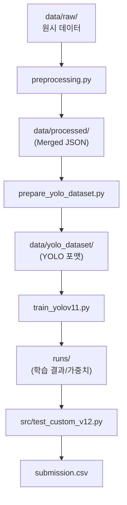

# 💊 PillaTech 알약 탐지 프로젝트 (Team 04)_260327

PillaTech 4팀의 알약 객체 탐지(Object Detection) 프로젝트입니다. 
이 가이드는 **Exp 12 Cleaned Baseline**을 바탕으로 실험을 고도화하려는 팀원들을 위한 온보딩 매뉴얼입니다.
배포 버전 기준은 **`v12 = Exp12 베이스라인`** 으로 고정합니다.

> [!IMPORTANT]
> **데이터 무결성 확보 (2026-03-27)**: 
> 이전의 **Exp 1~10** 실험 데이터셋에는 9건의 어노테이션 오류가 존재했을수도 있습니다. 팀 협의를 통해 모든 오류를 수정한 **Exp 12**를 새로운 **2차 베이스라인**으로 확정했습니다. 상세 내역은 [experiments.md](./experiments.md)를 참고하세요.

---

## 🏗️ 전체 파이프라인 구조 (Project Structure)
실험은 크게 **전처리 → 데이터셋 구축 → 학습/검증 → 추론**의 4단계로 구성됩니다.



## 📂 폴더 구조 (Directory Layout)
팀원 온보딩 기준으로 자주 보는 핵심 경로만 정리했습니다.

### 🔗 주요 경로 (Quick Links)
- **`configs/train/`**: 학습 설정 YAML
- **`configs/inference/`**: 추론 설정 YAML
- **`src/test_custom_v12.py`**: 추론 스크립트 (config/CLI 지원)
- **`runs/exp12_train_yolo11s_noflip/weights/best.pt`**: v12(Exp12) 배포 가중치 (Drive 공유 후 이 경로에 배치)
- **`data/raw/sprint_ai_project1_data/`**: 원본 데이터 (train/test images, annotations)
- **`data/yolo_dataset/`**: 학습에 직접 사용하는 YOLO 포맷 데이터셋
- **`metrics/`**: validation 성능 리포트 JSON
- **`submission/`**: 제출용 CSV 보관

상세한 실험별 경로, runs 폴더 계보, 재현 커맨드는 `experiments.md`를 참고하세요.
	
```text
PillaTech_team04/
├── README.md                      # 온보딩 매뉴얼
├── experiments.md                 # 실험 로그/인사이트 기록
├── requirements.txt               # 의존성 고정 (팀 환경 재현용)
├── preprocessing.py               # 데이터 정제/병합/합성 파이프라인
├── prepare_yolo_dataset.py        # YOLO 포맷 데이터셋 구축 스크립트
├── train_yolov11.py               # 학습 실행기 (YOLOv11)
├── src/                           # 추론/앙상블/평가 스크립트
│   ├── test_custom_v12.py         # 추론 엔진 (config/CLI 지원)
│   ├── ensemble_wbf.py            # WBF 앙상블
│   └── exp8_search.py             # NMS 파라미터 탐색
├── scripts/                       # 실험 파이프라인 실행용 셸 스크립트
│   ├── exp5/
│   ├── exp9/
│   └── exp10/
├── configs/                       # 실험 설정 (Reproducibility 핵심)
│   ├── train/                     # 학습 설정 YAML (exp12_train_*.yaml 등)
│   └── inference/                 # 추론 설정 YAML (exp12_inference_*.yaml 등)
├── data/                          # 데이터 저장소
│   ├── raw/                       # 원본 이미지/COCO JSON (보존)
│   │   └── sprint_ai_project1_data/
│   │       ├── test_images/
│   │       ├── train_images/
│   │       └── train_annotations/
│   ├── processed/                 # 전처리 산출물 (병합 JSON, 합성 이미지 등)
│   └── yolo_dataset/              # 학습에 직접 쓰는 YOLO 포맷 데이터셋
│       ├── images/
│       └── labels/

├── runs/                          # 학습 산출물 (weights/logs/plots)  # 보통 Git 미추적
│   ├── exp12_train_yolo11s_noflip/         # v12(Exp12) 베이스라인
│   │   └── weights/                        # best.pt, last.pt
│   └── ...                                 # 기타 실험 폴더들
├── metrics/                       # validation 성능 리포트 JSON
├── submission/                    # 제출용 CSV 보관
└── weights/                       # (선택) 베이스 모델 파일 보관 (yolo11s.pt 등)
```

### 핵심 파일 역할
- **`preprocessing.py`**: Raw COCO JSON을 이미지별로 병합하고, 계층적 분할(Stratified) 및 합성 증강(Copy-Paste) 수행.
- **`prepare_yolo_dataset.py`**: 병합된 JSON을 YOLO 학습용 디렉토리 구조 및 라벨 파일로 변환.
- **`train_yolov11.py`**: `configs/train/` 파일을 읽어 학습을 수행하고 `metrics/`에 결과를 자동 저장.
- **`src/test_custom_v12.py`**: CLI 인자와 `configs/inference/`를 지원하는 범용 추론 스크립트.
-

> [!NOTE]
> `configs/train/*.yaml`의 `copy_paste`는 **Ultralytics YOLO 내부 증강(augmentation)기법 옵션**입니다. Exp 5에서 사용한 "커스텀 합성 데이터로 데이터셋 자체를 증량(희귀 클래스 증강, Copy Paste)"하는 방식과는 별개이며, Exp5 방식의 (데이터셋 자체 증량)은 YOLO의 copy_paste 파라미터가 아니라, dataset.yaml이 가리키는 실제 학습 데이터 폴더에 합성 결과가 들어가 있느냐로 결정됩니다

 > `src/test_legacy.py`: (구 `test.py`) 실수 방지 목적으로 예원님 원본 버전 삭제함 

---

## 🚀 퀵스타트: 환경 구축 및 실행
아래 모든 명령은 프로젝트 **루트 폴더인 `PillaTech_team04/`** 에서 실행하세요.

### 1단계: 가상환경 설정
```bash
conda create -n codeit python=3.12 -y
conda activate codeit
pip install -r requirements.txt
```

> [!NOTE]
> `requirements.txt`는 `codeit` 가상환경에서 검증된 모든 패키지 버전을 포함하고 있습니다. 환경 차이로 인한 오류를 방지하기 위해 반드시 위 명령어로 설치를 권장합니다.

### 2단계: 데이터 준비 (Exp 12 기준)
원본 이미지 데이터를 아래 구조(Folder Structure)에 맞춰 `data/raw/` 폴더에 배치합니다. 

```text
data/raw/sprint_ai_project1_data/
├── test_images/         # 추론용 테스트 이미지 (.png)
├── train_annotations/   # 정제된 COCO 포맷 JSON (pred/yewon 브랜치 데이터 클렌징 버전 참고)
└── train_images/        # 학습용 원본 이미지 (.png)
```

배치 후 다음을 순차적으로 실행하여 **데이터 동기화**를 수행합니다.
```bash
# 1. 960px 해상도, Stratified 분할, Copy-Paste 증강 적용 JSON 생성
python preprocessing.py

# 2. YOLO 데이터셋 구축 (Images & Labels 복사)
python prepare_yolo_dataset.py
```

### 3단계: 학습 시작 (Exp 12 상속)
Exp 12 실험을 재현하거나 이를 바탕으로 새 실험을 시작하려면 다음을 참고하세요:

1. **기본 데이터셋**: `data/yolo_dataset/dataset.yaml` 경로를 기본으로 사용합니다. 별도 명시가 없으면 이 경로의 데이터를 불러옵니다.
   ```bash
   python train_yolov11.py --config configs/train/exp12_train_yolo11s_noflip.yaml
   ```

2. **커스텀 데이터셋**: 다른 경로의 데이터셋을 사용하고 싶다면 `--data` 옵션으로 명시하면 됩니다.
   ```bash
   # 다른 데이터셋 경로 사용 예시
   python train_yolov11.py --config configs/train/exp12_train_yolo11s_noflip.yaml --data <path/to/dataset.yaml>
   ```

---
## 💡 가중치 운영 가이드 (Weights Policy)
Google Drive로 공유받은 가중치는 아래 경로에 그대로 배치하는 것을 권장합니다.

```bash
# 예시: Exp 12 베이스라인 가중치 배치
mkdir -p runs/exp12_train_yolo11s_noflip/weights/
# 이후 best.pt를 위 폴더에 저장
# (추론 설정 파일의 model 경로와 동일해야 함)
```

### ⚙️ 추론 권장 설정 (Inference Settings)
Exp 12 베이스라인과 동일한 성능을 재현하려면 추론 시 아래 파라미터를 반드시 준수하거나 '전용 설정'파일을 사용하세요.

*   **설정 파일**: `configs/inference/exp12_inference_yolo11s_noflip.yaml`
*   **해상도 (`imgsz`)**: **960**
*   **임계값**: `conf: 0.25`, `iou: 0.70`
*   **전용 설정의 의미**: 여기서 전용 설정은 **추론용 설정 파일**(`configs/inference/...`)을 의미합니다. (`configs/train/...`은 학습용)
*   **실행 분기**
    *   가중치가 이미 있으면: `python src/test_custom_v12.py --config configs/inference/exp12_inference_yolo11s_noflip.yaml`
    *   Exp 12를 처음부터 재현하면: `python train_yolov11.py --config configs/train/exp12_train_yolo11s_noflip.yaml` 실행 후 위 추론 명령 실행
*   **가중치 공유 방법**: `runs/exp12_train_yolo11s_noflip/weights/best.pt`는 Google Drive에 공유되어 있습니다. 4조 팀원분들은 같은 경로에 배치해주세요. (이 경로를 `configs/inference/exp12_inference_yolo11s_noflip.yaml`의 `model`이 참조합니다. `runs/`는 용량 이슈로 보통 Git에 올리지 않습니다.)

---

## 🧭 실험 운영 규칙 (Naming Policy)
아래 3가지를 일치시켜 실험 계보를 명확히 관리하세요.

| 구분 | Exp12 예시 값 |
| --- | --- |
| 파일명(확장자 제외) | `exp12_train_yolo11s_noflip` |
| YAML 내 `name` | `exp12_train_yolo11s_noflip` |
| `runs` 폴더명 | `runs/exp12_train_yolo11s_noflip/` |

---

## 📈 실험 고도화 가이드 (Next Step)
현재 팀의 최고 점수는 오염된 데이터가 유입되었을 수도 있는 **Exp 10 (3-Seed Ensemble / Kaggle: 0.98073)** 입니다. 

1.  **설정 상속**: `configs/train/exp12_train_yolo11s_noflip.yaml`을 복사하여 모델 size(`yolo11m`) 혹은 새로운 아키텍처(RT-DETR 등)로 확장하세요.
2.  **앙상블 전략**: 정제된 Exp 12 가중치를 바탕으로 시드 앙상블 혹은 멀티스케일 추론(`src/ensemble_wbf.py`)을 적용하여 0.99 돌파를 목표로 해봅시다. 

---

## 🛠️ 기타 도구 (Optional)
다음 파일들은 특정 실험 목적(Exp 8, 9 등)을 위해 생성되었으며, 일반적인 Exp 12 학습에는 필수적이지 않습니다. 필요 없을 경우 삭제해도 무방합니다.

- **`src/ensemble_wbf.py`**: 여러 결과 CSV를 WBF로 병합.
- **`src/eval_csv_map.py`**: CSV 파일을 로컬 라벨과 비교해 mAP 측정.
- **`src/exp8_search.py`**: 최적의 NMS 임계값(conf, iou) 탐색.

---
© PillaTech Team 04
