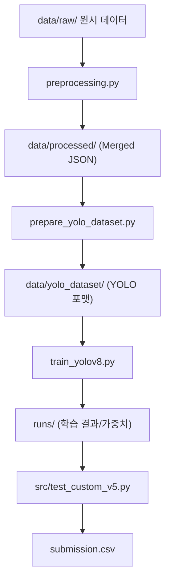

# 💊 PillaTech 알약 탐지 프로젝트 (Team 04)

PillaTech 4팀의 알약 객체 탐지(Object Detection) 프로젝트입니다. 
이 가이드는 **Exp 5 Baseline**을 바탕으로 실험을 고도화하려는 팀원들을 위한 온보딩 매뉴얼입니다.

---

## 🏗️ 전체 파이프라인 구조 (Project Structure)

실험은 크게 **전처리 → 데이터셋 구축 → 학습/검증 → 추론**의 4단계로 구성됩니다.



### 핵심 파일 역할
- **`preprocessing.py`**: Raw COCO JSON을 이미지별로 병합하고, 계층적 분할(Stratified) 및 합성 증강(Copy-Paste) 수행.
- **`prepare_yolo_dataset.py`**: 병합된 JSON을 YOLO 학습용 디렉토리 구조 및 라벨 파일로 변환.
- **`train_yolov8.py`**: `configs/` 파일을 읽어 학습을 수행하고 `metrics/`에 결과를 자동 저장.
- **`src/test_custom_v5.py`**: CLI 인자를 지원하는 범용 추론 스크립트 (Kaggle 제출용).
- **`src/test_legacy.py`**: (구 `test.py`) 예원님 원본 버전. 하드코딩 경로 사용 시 참고용.

---

## 🚀 퀵스타트: 환경 구축 및 실행

### 1단계: 가산환경 설정
```bash
conda create -n codeit python=3.12 -y
conda activate codeit
pip install -r requirements.txt
```

> [!NOTE]
> `requirements.txt`는 `codeit` 가상환경에서 검증된 모든 패키지 버전을 포함하고 있습니다. 환경 차이로 인한 오류를 방지하기 위해 반드시 위 명령어로 설치를 권장합니다.

### 2단계: 데이터 준비 (Exp 5 기준)
원본 이미지 데이터를 아래 구조(Folder Structure)에 맞춰 `data/raw/` 폴더에 배치합니다. 
(이 구조가 일치해야 `preprocessing.py`가 데이터를 정상적으로 인식합니다.)

```text
data/raw/sprint_ai_project1_data/
├── test_images/         # 추론용 테스트 이미지 (.png)
├── train_annotations/   # COCO 포맷 JSON 어노테이션(예원님 데이터 클렌징 버전)
└── train_images/        # 학습용 원본 이미지 (.png)
```

배치 후 다음을 순차적으로 실행합니다.
```bash
# 1. 전처리 (Merged JSON & Split 생성)
python preprocessing.py

# 2. YOLO 데이터셋 구축 (Images & Labels 복사)
python prepare_yolo_dataset.py
```

### 3단계: 학습 시작 (Exp 5 상속)
Exp 5의 설정을 재현하거나 이를 바탕으로 새 실험을 시작하려면:
```bash
python train_yolov8.py --config configs/exp5_train.yaml
```

---

## 💡 Exp 5 가중치 배치 가이드 (Shared Weights)

공유받은 Exp 5 가중치(`best.pt`)는 아래 경로에 폴더를 직접 생성하여 저장하는 것을 권장합니다. 
(이렇게 배치해야 기존 실험 설정 파일들과 경로가 일치하여 에러가 발생하지 않습니다.)

```bash
# 프로젝트 루트에서 실행
mkdir -p runs/pill_exp5_yolo11s_copypaste/weights/
# 해당 폴더 안에 공유받은 best.pt를 배치합니다.
```

---

## 📈 실험 고도화 가이드 (Evolving from Baseline)

현재 팀의 Public 최고 점수(0.972)는 **Exp 5 가중치**와 **Exp 9의 멀티스케일 WBF 추론 기법**의 조합입니다.

1.  **설정 상속**: `configs/exp5_train.yaml`을 복사하여(`cp`) 모델 체급(`yolo11m`), 에폭, 혹은 새로운 증강 옵션을 추가하여 실험을 확장하세요.
2.  **가중치 활용**: 공유받은 `best.pt`를 불러와 추가 학습(Fine-tuning)을 하거나, Pseudo-labeling의 기반 모델로 사용합니다.
3.  **앙상블 전략**: `src/ensemble_wbf.py`를 이용해 서로 다른 모델의 예측을 결합합니다. (멀티스케일 등 상세 기법은 `experiments.md` 참고)

### 성능 측정 지표 (Metrics)
학습 완료 시 `metrics/` 폴더에 JSON이 자동 생성됩니다. 이를 바탕으로 `experiments.md`를 업데이트하여 실험 히스토리를 관리하면 좋습니다.

---

## 🛠️ 기타 도구 (Optional)
다음 파일들은 특정 실험 목적(Exp 8, 9 등)을 위해 생성되었으며, 일반적인 Exp 5 학습에는 필수적이지 않습니다. 필요 없을 경우 삭제해도 무방합니다.

- **`src/ensemble_wbf.py`**: 여러 결과 CSV를 WBF로 병합.
- **`src/eval_csv_map.py`**: CSV 파일을 로컬 라벨과 비교해 mAP 측정.
- **`src/exp8_search.py`**: 최적의 NMS 임계값(conf, iou) 탐색.

---
© PillaTech Team 04
